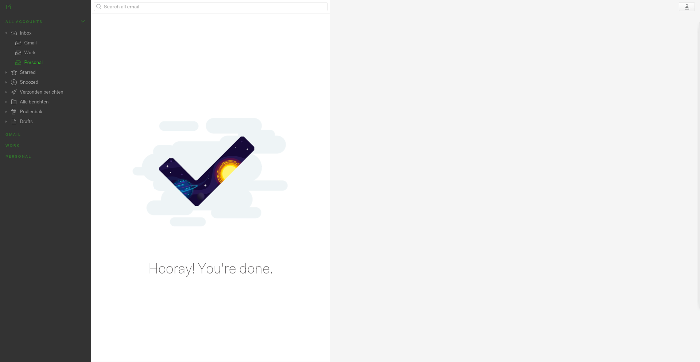

# Gluo Theme Nylas N1
A customizable, dark sidebar theme for [Nylas N1](https://nylas.com/n1).

## Installation

### Step 1: Download

#### Option 1: via the command line
`git clone https://github.com/gluobe/gluo-theme-nylas.git `

### Step 2: Install
In `Nylas N1 > Edit` and choose `Install a theme…`.

### Step 3: Activate
In `Nylas N1 > Edit` and choose `Change theme…` and select the Gluo theme.

### Credits

Our credits go out to Jamie Wilson, the creator of the Darkside theme. This is a fork of the [Darksite theme](http://jamiewilson.io/darkside/).
